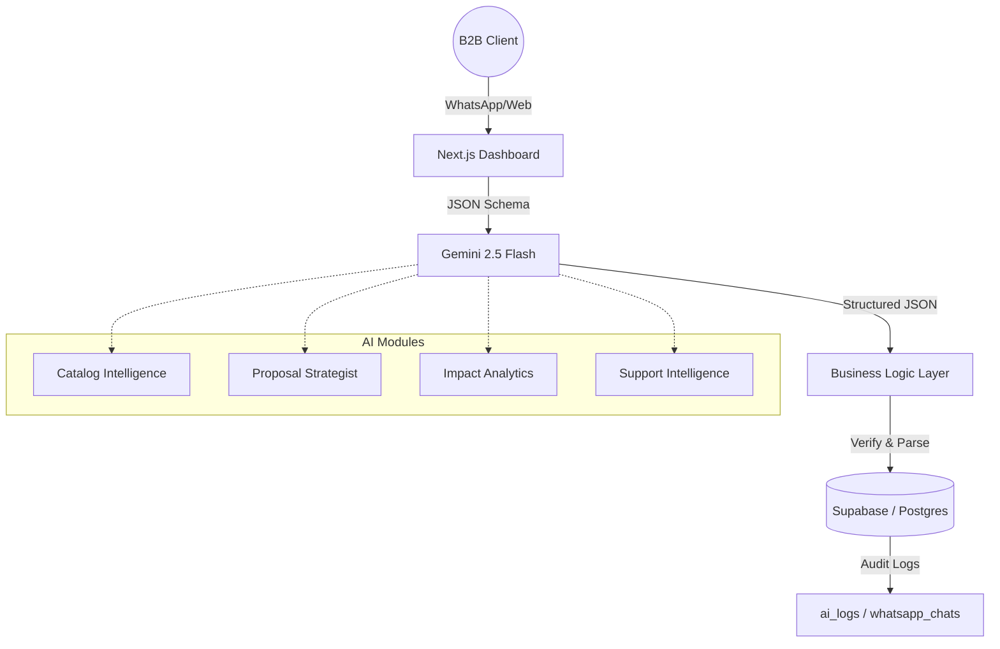

# 🌍 Intelligent Sustainable Commerce OS

## 🎯 Objective
This project implements a suite of AI-powered modules designed to streamline B2B sustainable commerce operations. It leverages **Gemini 2.5 Flash** for high-speed, structured reasoning, ensuring that every AI output is grounded in business logic and ready for immediate database integration.

## 🏗️ Architecture Overview
The system follows a modern **AI Gateway Pattern**, strictly separating the presentation layer from the core business reasoning logic.

*   **Frontend**: Next.js (App Router) with a premium "Elite Glassmorphism" UI.
*   **AI Engine**: Google Gemini API utilizing `responseSchema` for deterministic JSON outputs.
*   **Database**: Supabase (PostgreSQL) for relational data and `JSONB` audit logging.
*   **Integration**: WhatsApp Cloud API via a custom Node.js/Next.js Webhook.

## 🧠 AI Prompt Design Strategy
To achieve the highest standards of **Business Logic Grounding**, the system utilizes several advanced prompting techniques:

1.  **Strict Enums & Schema Enforcement**: The AI is never allowed to "hallucinate" categories. Every module is backed by a TypeScript-defined JSON schema that restricts outputs (e.g., Primary Categories are limited to a predefined list).
2.  **Chain-of-Thought (CoT) Reasoning**: For math-heavy modules like the **Proposal Strategist** and **Impact Analytics**, the AI is required to return a `calculation_logic` field. This forces the model to articulate its math before finalizing results, ensuring accuracy in budgets and environmental metrics.
3.  **Intent Classifier Pattern**: In the **Support Intelligence** module, the AI acts as a router. It first classifies the user's intent and checks for escalation flags before generating a response, allowing the backend to handle sensitive requests (like refunds) separately from general inquiries.

## ⚙️ Implemented Modules
- [x] **Module 1: Catalog Intelligence** - Automated categorization, sub-categorization, and B2B SEO tagging.
- [x] **Module 2: Proposal Strategist** - Dynamic B2B proposal generation grounded in real-time budgets and product mixes.
- [x] **Module 3: Impact Analytics** - Data-driven environmental reporting utilizing industry-standard baselines for CO2 and plastic savings.
- [x] **Module 4: Support Intelligence** - A production-ready WhatsApp bot integration with automated escalation and database context awareness.

## 🚀 Getting Started
1.  **Environment Setup**: Copy `.env.example` to `.env.local` and provide your Meta and Gemini API keys.
2.  **Database Migration**: Run the provided SQL scripts in the Supabase SQL Editor.
3.  **Local Development**: Run `npm run dev` to launch the dashboard.
4.  **Webhook Setup**: Configure your Meta App to point to `/api/webhook` using your defined verify token.
